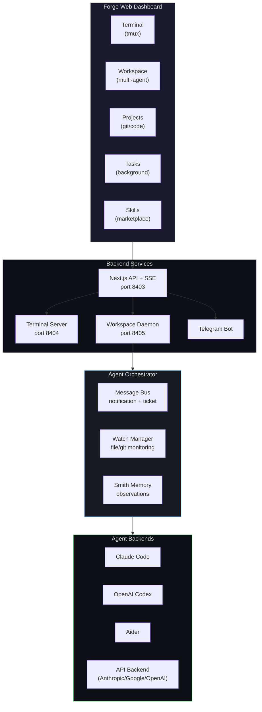
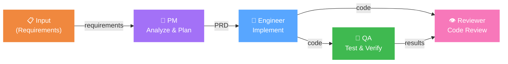
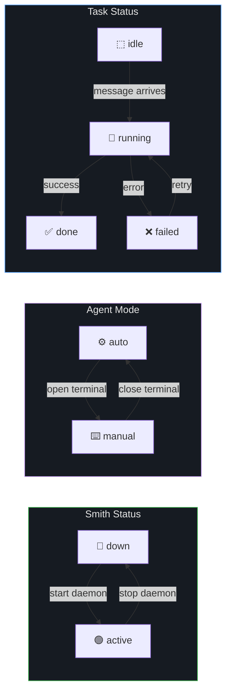
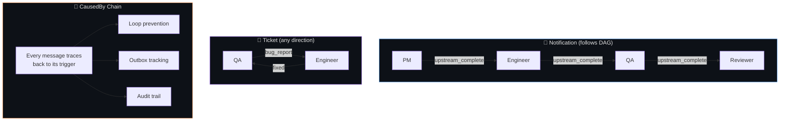
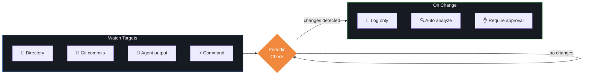

<p align="center">
  
</p>

<h1 align="center">Forge</h1>

<p align="center">
  <strong>Self-hosted Multi-Agent Vibe Coding Platform</strong><br>
  Multi-agent workspace · Browser terminal · AI tasks · Remote access · Telegram bot
</p>

<p align="center">
  <a href="https://www.npmjs.com/package/@aion0/forge"></a>
  <a href="https://github.com/aiwatching/forge/blob/main/LICENSE"></a>
  <a href="https://github.com/aiwatching/forge"></a>
</p>

<p align="center">
  <a href="https://www.youtube.com/watch?v=F3fiSiP3pZY">Watch Demo</a>
</p>

---

## Demo & Install Guide

[](https://www.youtube.com/watch?v=F3fiSiP3pZY)

## Install

```bash
npm install -g @aion0/forge
forge server start
```

Open `http://localhost:8403`. First launch prompts you to set an admin password.

**Requirements:** Node.js >= 20, tmux, [Claude Code CLI](https://docs.anthropic.com/en/docs/claude-code)

## What is Forge?

Forge turns Claude Code into a **multi-agent remote coding platform**. Define a team of AI agents (PM, Engineer, QA, Reviewer), set dependencies, and let them collaborate through a message-driven workflow. Or use it as a single-agent Vibe Coding environment with persistent sessions.

No API keys required. Uses your existing Claude Code subscription. Code never leaves your machine.

## Architecture



## Multi-Agent Workspace (v0.5.0)

Define a team of agents with roles, dependencies, and steps. The daemon orchestrates execution while agents communicate through a structured message system.

### Agent Workflow



### Three-Layer State Model

Each agent (Smith) maintains three independent status layers:



### Message System

Two message categories prevent loops while enabling flexible communication:



### Watch Manager

Agents can autonomously monitor file changes, git commits, or custom commands:



### Agent Profiles

Reusable configurations for different CLI tools and API endpoints:

```yaml
# settings.yaml
agents:
  claude-opus:
    base: claude
    name: Claude Opus
    model: claude-opus-4-6

  forti-k2:
    base: claude
    name: Forti K2
    model: forti-k2
    env:
      ANTHROPIC_BASE_URL: http://my-server:7001/
      ANTHROPIC_AUTH_TOKEN: sk-xxx
```

## Features

| | |
|---|---|
| **Multi-Agent Workspace** | Define agent teams (PM, Engineer, QA, Reviewer) with DAG dependencies, message bus, watch monitoring |
| **Agent Profiles** | Reusable CLI/API configurations with env vars, model overrides, custom endpoints |
| **Vibe Coding** | Browser tmux terminal, multi-tab, split panes, WebGL rendering, Ctrl+F search |
| **AI Tasks** | Background Claude Code execution with live streaming output |
| **Pipelines** | YAML DAG workflows with parallel execution, conversation mode, visual editor |
| **Remote Access** | Cloudflare Tunnel with 2FA (password + session code) |
| **Docs Viewer** | Obsidian / markdown rendering with AI assistant |
| **Projects** | File browser, git operations, code viewer with syntax highlighting, diff view |
| **Skills** | Marketplace with incremental sync, version tracking, auto-install |
| **Telegram** | Tasks, sessions, notes, tunnel control from mobile |
| **CLI** | `forge task`, `forge watch`, `forge status`, and more |

## Quick Start

```bash
forge server start              # start (background by default)
forge server start --foreground # run in foreground
forge server start --dev        # dev mode with hot-reload
forge server stop               # stop
forge server restart            # restart
```

### From source

```bash
git clone https://github.com/aiwatching/forge.git
cd forge && pnpm install
./start.sh          # production
./start.sh dev      # development
```

## CLI

```bash
forge task <project> <prompt>   # submit a task
forge tasks                     # list tasks
forge watch <id>                # live stream output
forge status                    # process status
forge tcode                     # show tunnel URL + session code
forge projects                  # list projects
forge flows                     # list workflows
forge run <flow>                # run a workflow
forge --reset-password          # reset admin password
```

## Telegram Bot

Create a bot via [@BotFather](https://t.me/botfather), add the token in Settings.

`/task` -- create task | `/tasks` -- list | `/sessions` -- AI summary | `/note` -- quick note | `/tunnel_start` -- start tunnel | `/watch` -- monitor session

## Data

All data in `~/.forge/` -- settings, database, terminal state, workflows, workspaces, logs. Configurable via `--dir` flag.

## License

[MIT](LICENSE)
